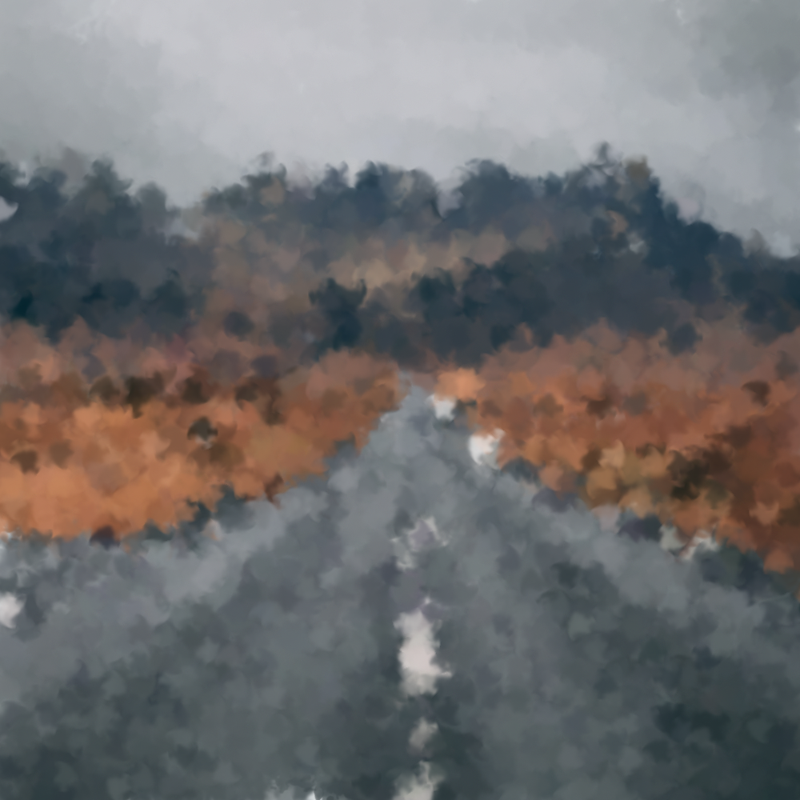
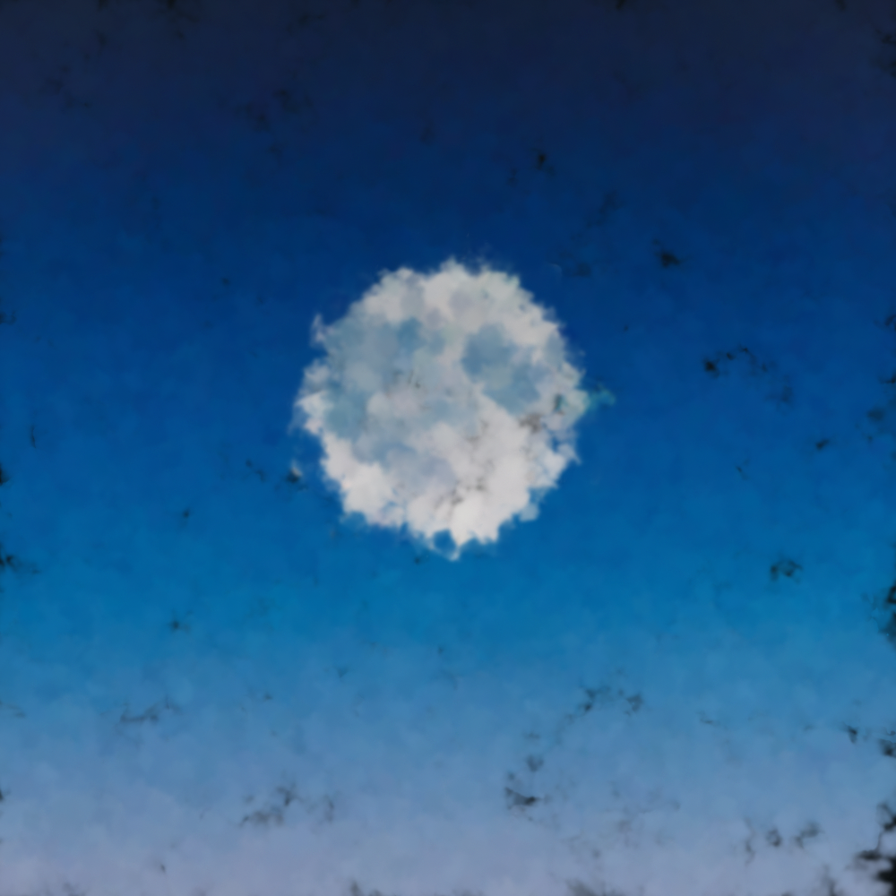
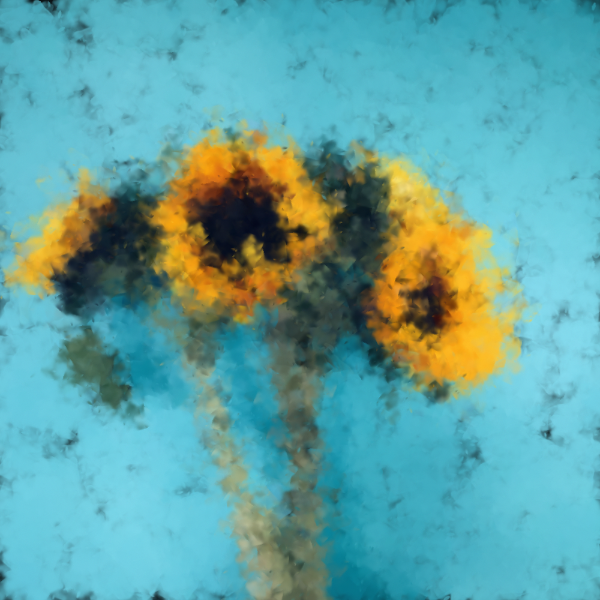
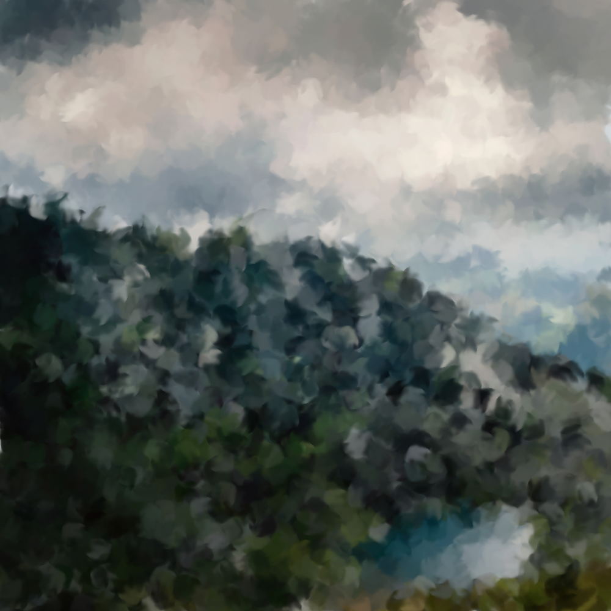
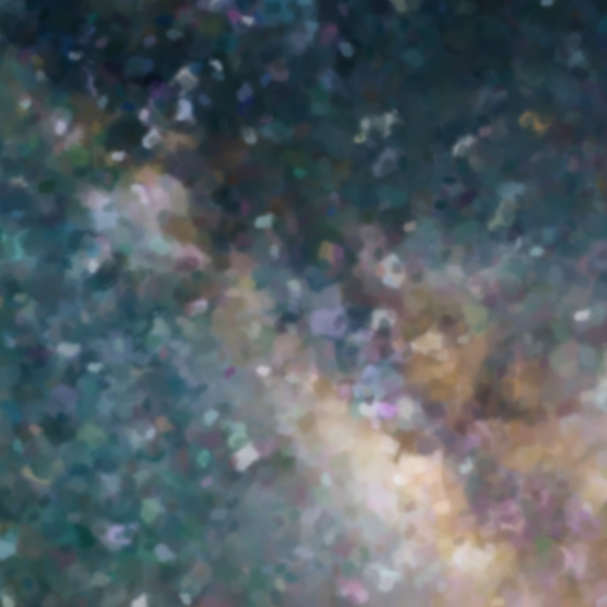
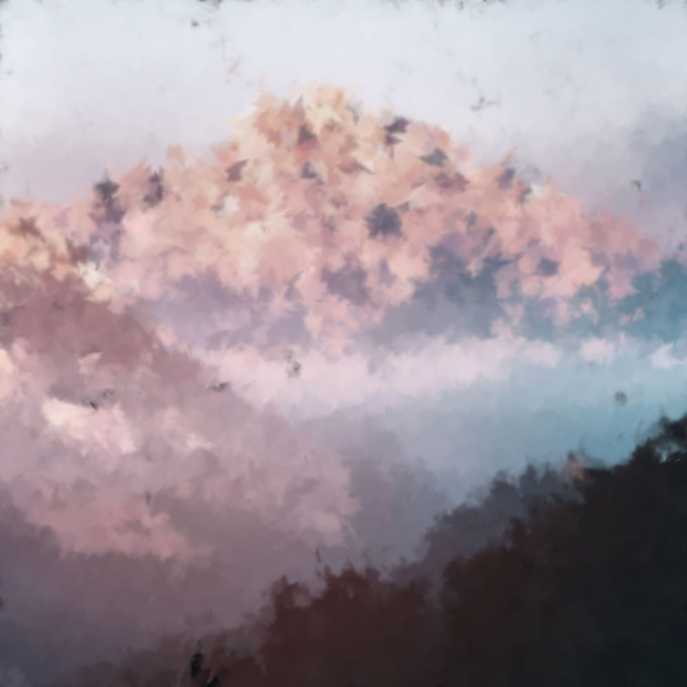

# Painter

Generate paintings from images.

Example images were downloaded from Pexels.
Brushes were extracted from [here](https://www.deviantart.com/pstutorialsws/art/Watercolor-Splatters-160738581). 

## Example results

<table>
<tr>
<th></th>
<th></th></tr>
<tr>
<th></th>
<th></th></tr>
<tr>
<th></th>
<th></th></tr>
</table>